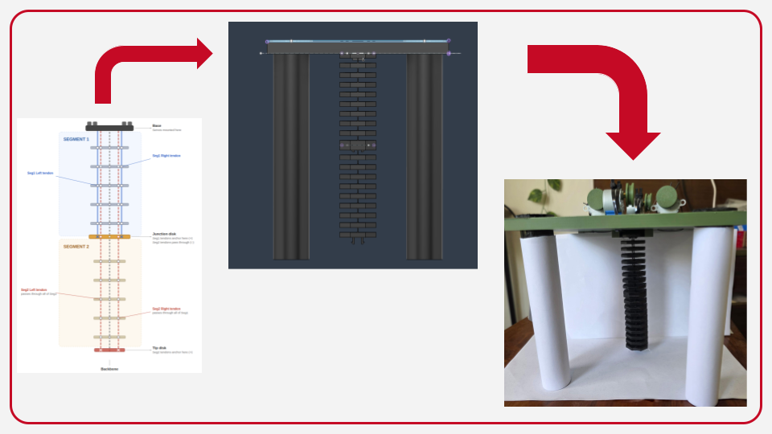

# ML Control Pipeline for a Tendon-Driven Continuum Soft Robot

This repository presents an end-to-end robotics project for a custom tendon-driven continuum soft robot. The project combines mechanical design, electronics integration, embedded motor control, computer vision-based data collection, PyTorch model training, and obstacle-aware inverse kinematics.

The robot was designed as a 2D planar tendon-driven continuum robot actuated by four motors. Instead of relying only on simplified geometric modelling, the project uses real hardware data to learn the relationship between tendon actuation and the robot’s full-body shape.

## Project Highlights

* CAD-designed and assembled a custom tendon-driven continuum robot structure.
* Built a four-motor tendon actuation system controlled using an ESP32 setup.
* Developed Python serial communication for automated robot movement and dataset collection.
* Created an OpenCV tracking pipeline to extract the robot backbone from camera footage.
* Collected 5,000 real hardware actuation-shape samples.
* Represented the robot body using 20 tracked 2D backbone points.
* Trained PyTorch MLP models for tip-only prediction and full-body shape prediction.
* Compared learning-based models against a Piecewise Constant Curvature baseline.
* Implemented obstacle-aware inverse kinematics using the learned full-body forward model.

## System Overview

## Project Overview



The project follows this pipeline:

```text
CAD Design → Physical Robot Build → Motor Control → Vision Tracking → Dataset Collection → ML Training → Obstacle-Aware Planning
```

## Mechanical Design

The robot was CAD-designed from scratch, including the frame, tendon routing, motor mounts, and structural supports. The design was built to support repeatable tendon actuation and camera-based tracking in a planar experimental setup.

CAD assets are included in:

```text
cad/
```

## Electronics and Firmware

The robot uses a four-motor tendon actuation system controlled through an ESP32/Arduino-based controller. The firmware receives serial commands from Python and moves the motors according to the requested tendon/spool changes.

Firmware is included in:

```text
electronics/motor_controller.ino
```

## Data Collection

The data collection script controls the robot, captures camera frames, tracks the robot backbone, and logs each sample to CSV.

Each sample stores:

* Motor/spool positions
* Movement command
* Tracking status
* Base position
* Tip position
* Full 20-point backbone shape

Data collection code is included in:

```text
data_collection/data_collect.py
```

## Machine Learning

Two PyTorch MLP models were trained:

### Tip-Only Model

Maps four motor/spool positions to the 2D robot tip position.

```text
Input:  [motor_0, motor_1, motor_2, motor_3]
Output: [tip_x, tip_y]
```

### Full-Body Shape Model

Maps four motor/spool positions to the full robot backbone.

```text
Input:  [motor_0, motor_1, motor_2, motor_3]
Output: 20 backbone points × 2D coordinates
```

The full-body model is more useful for obstacle avoidance because it predicts the entire robot shape, not only the end-effector.

Training and evaluation scripts are included in:

```text
models/
```

## Obstacle-Aware Inverse Kinematics

The learned full-body model is used as a forward model inside a sampling-based inverse kinematics planner.

The planner searches for motor configurations that:

* Move the robot tip close to the target.
* Avoid collisions with obstacles.
* Maintain safe clearance along the full robot body.
* Penalise unsafe or overly aggressive configurations.

Planning code is included in:

```text
planning/obs_multi.py
```

## Results

The learning-based models significantly improved prediction accuracy compared to the geometric baseline.

| Model                    | Mean Tip Error | Shape RMSE | Correlation |
| ------------------------ | -------------: | ---------: | ----------: |
| PCC Baseline             |      106.14 px |   38.60 px |       0.969 |
| Tip-Only Neural Network  |       13.04 px |        N/A |         N/A |
| Full-Body Neural Network |         ~16 px |   ~6.76 px |      ~0.998 |

The obstacle-aware planner demonstrated that full-body shape prediction can help avoid collisions that would not be visible from tip-only control.

## Repository Structure

```text
cad-to-ml-control-soft-robot/
├── cad/
├── firmware/
├── data_collection/
├── models/
├── planning/
├── results/
├── sample_data/
└── report/
```

## Tech Stack

* Python
* PyTorch
* OpenCV
* NumPy
* Pandas
* Matplotlib
* Arduino/C++
* ESP32
* CAD modelling
* Computer vision
* Machine learning
* Soft robotics

## Running the Project

Install dependencies:

```bash
pip install -r requirements.txt
```

Run data collection:

```bash
python data_collection/data_collect.py
```

Train the full-body model:

```bash
python models/train_mlp.py
```

Train the tip-only model:

```bash
python models/train_tip_only_mlp.py
```

Evaluate the models:

```bash
python models/eval_mlp.py
python models/eval_tip_only_mlp.py
```

Run obstacle-aware planning:

```bash
python planning/obs_multi.py
```

## Notes

This project was developed using a physical soft robotics hardware setup. Some scripts require the correct camera, serial port, motor controller, and robot configuration to reproduce the full pipeline.

## Future Improvements

* Add closed-loop control using live camera feedback.
* Extend the robot from 2D planar motion to 3D motion.
* Improve mechanical design to reduce backlash and tendon slack.
* Add a more modular configuration system for ports, camera settings, and robot parameters.
* Test the planner on more complex obstacle environments.
